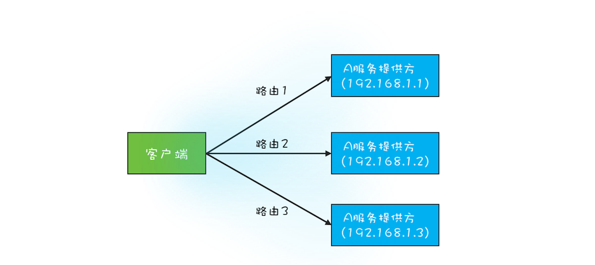

---
date: "2019-06-23"
---  
      
# 29 | Copy-on-Write模式：不是延时策略的COW
在上一篇文章中我们讲到Java里String这个类在实现replace\(\)方法的时候，并没有更改原字符串里面value\[\]数组的内容，而是创建了一个新字符串，这种方法在解决不可变对象的修改问题时经常用到。如果你深入地思考这个方法，你会发现它本质上是一种**Copy-on-Write方法**。所谓Copy-on-Write，经常被缩写为COW或者CoW，顾名思义就是**写时复制**。

不可变对象的写操作往往都是使用Copy-on-Write方法解决的，当然Copy-on-Write的应用领域并不局限于Immutability模式。下面我们先简单介绍一下Copy-on-Write的应用领域，让你对它有个更全面的认识。

## Copy-on-Write模式的应用领域

我们前面在[《20 | 并发容器：都有哪些“坑”需要我们填？》](https://time.geekbang.org/column/article/90201)中介绍过CopyOnWriteArrayList和CopyOnWriteArraySet这两个Copy-on-Write容器，它们背后的设计思想就是Copy-on-Write；通过Copy-on-Write这两个容器实现的读操作是无锁的，由于无锁，所以将读操作的性能发挥到了极致。

除了Java这个领域，Copy-on-Write在操作系统领域也有广泛的应用。

<!-- [[[read_end]]] -->

我第一次接触Copy-on-Write其实就是在操作系统领域。类Unix的操作系统中创建进程的API是fork\(\)，传统的fork\(\)函数会创建父进程的一个完整副本，例如父进程的地址空间现在用到了1G的内存，那么fork\(\)子进程的时候要复制父进程整个进程的地址空间（占有1G内存）给子进程，这个过程是很耗时的。而Linux中的fork\(\)函数就聪明得多了，fork\(\)子进程的时候，并不复制整个进程的地址空间，而是让父子进程共享同一个地址空间；只用在父进程或者子进程需要写入的时候才会复制地址空间，从而使父子进程拥有各自的地址空间。

本质上来讲，父子进程的地址空间以及数据都是要隔离的，使用Copy-on-Write更多地体现的是一种**延时策略，只有在真正需要复制的时候才复制，而不是提前复制好**，同时Copy-on-Write还支持按需复制，所以Copy-on-Write在操作系统领域是能够提升性能的。相比较而言，Java提供的Copy-on-Write容器，由于在修改的同时会复制整个容器，所以在提升读操作性能的同时，是以内存复制为代价的。这里你会发现，同样是应用Copy-on-Write，不同的场景，对性能的影响是不同的。

在操作系统领域，除了创建进程用到了Copy-on-Write，很多文件系统也同样用到了，例如Btrfs \(B-Tree File System\)、aufs（advanced multi-layered unification filesystem）等。

除了上面我们说的Java领域、操作系统领域，很多其他领域也都能看到Copy-on-Write的身影：Docker容器镜像的设计是Copy-on-Write，甚至分布式源码管理系统Git背后的设计思想都有Copy-on-Write……

不过，**Copy-on-Write最大的应用领域还是在函数式编程领域**。函数式编程的基础是不可变性（Immutability），所以函数式编程里面所有的修改操作都需要Copy-on-Write来解决。你或许会有疑问，“所有数据的修改都需要复制一份，性能是不是会成为瓶颈呢？”你的担忧是有道理的，之所以函数式编程早年间没有兴起，性能绝对拖了后腿。但是随着硬件性能的提升，性能问题已经慢慢变得可以接受了。而且，Copy-on-Write也远不像Java里的CopyOnWriteArrayList那样笨：整个数组都复制一遍。Copy-on-Write也是可以按需复制的，如果你感兴趣可以参考Purely Functional Data Structures这本书，里面描述了各种具备不变性的数据结构的实现。

CopyOnWriteArrayList和CopyOnWriteArraySet这两个Copy-on-Write容器在修改的时候会复制整个数组，所以如果容器经常被修改或者这个数组本身就非常大的时候，是不建议使用的。反之，如果是修改非常少、数组数量也不大，并且对读性能要求苛刻的场景，使用Copy-on-Write容器效果就非常好了。下面我们结合一个真实的案例来讲解一下。

## 一个真实案例

我曾经写过一个RPC框架，有点类似Dubbo，服务提供方是多实例分布式部署的，所以服务的客户端在调用RPC的时候，会选定一个服务实例来调用，这个选定的过程本质上就是在做负载均衡，而做负载均衡的前提是客户端要有全部的路由信息。例如在下图中，A服务的提供方有3个实例，分别是192.168.1.1、192.168.1.2和192.168.1.3，客户端在调用目标服务A前，首先需要做的是负载均衡，也就是从这3个实例中选出1个来，然后再通过RPC把请求发送选中的目标实例。



RPC路由关系图

RPC框架的一个核心任务就是维护服务的路由关系，我们可以把服务的路由关系简化成下图所示的路由表。当服务提供方上线或者下线的时候，就需要更新客户端的这张路由表。


我们首先来分析一下如何用程序来实现。每次RPC调用都需要通过负载均衡器来计算目标服务的IP和端口号，而负载均衡器需要通过路由表获取接口的所有路由信息，也就是说，每次RPC调用都需要访问路由表，所以访问路由表这个操作的性能要求是很高的。不过路由表对数据的一致性要求并不高，一个服务提供方从上线到反馈到客户端的路由表里，即便有5秒钟，很多时候也都是能接受的（5秒钟，对于以纳秒作为时钟周期的CPU来说，那何止是一万年，所以路由表对一致性的要求并不高）。而且路由表是典型的读多写少类问题，写操作的量相比于读操作，可谓是沧海一粟，少得可怜。

通过以上分析，你会发现一些关键词：对读的性能要求很高，读多写少，弱一致性。它们综合在一起，你会想到什么呢？CopyOnWriteArrayList和CopyOnWriteArraySet天生就适用这种场景啊。所以下面的示例代码中，RouteTable这个类内部我们通过`ConcurrentHashMap<String, CopyOnWriteArraySet<Router>>`这个数据结构来描述路由表，ConcurrentHashMap的Key是接口名，Value是路由集合，这个路由集合我们用是CopyOnWriteArraySet。

下面我们再来思考Router该如何设计，服务提供方的每一次上线、下线都会更新路由信息，这时候你有两种选择。一种是通过更新Router的一个状态位来标识，如果这样做，那么所有访问该状态位的地方都需要同步访问，这样很影响性能。另外一种就是采用Immutability模式，每次上线、下线都创建新的Router对象或者删除对应的Router对象。由于上线、下线的频率很低，所以后者是最好的选择。

Router的实现代码如下所示，是一种典型Immutability模式的实现，需要你注意的是我们重写了equals方法，这样CopyOnWriteArraySet的add\(\)和remove\(\)方法才能正常工作。

```
    //路由信息
    public final class Router{
      private final String  ip;
      private final Integer port;
      private final String  iface;
      //构造函数
      public Router(String ip, 
          Integer port, String iface){
        this.ip = ip;
        this.port = port;
        this.iface = iface;
      }
      //重写equals方法
      public boolean equals(Object obj){
        if (obj instanceof Router) {
          Router r = (Router)obj;
          return iface.equals(r.iface) &&
                 ip.equals(r.ip) &&
                 port.equals(r.port);
        }
        return false;
      }
      public int hashCode() {
        //省略hashCode相关代码
      }
    }
    //路由表信息
    public class RouterTable {
      //Key:接口名
      //Value:路由集合
      ConcurrentHashMap<String, CopyOnWriteArraySet<Router>> 
        rt = new ConcurrentHashMap<>();
      //根据接口名获取路由表
      public Set<Router> get(String iface){
        return rt.get(iface);
      }
      //删除路由
      public void remove(Router router) {
        Set<Router> set=rt.get(router.iface);
        if (set != null) {
          set.remove(router);
        }
      }
      //增加路由
      public void add(Router router) {
        Set<Router> set = rt.computeIfAbsent(
          route.iface, r -> 
            new CopyOnWriteArraySet<>());
        set.add(router);
      }
    }
    

```

## 总结

目前Copy-on-Write在Java并发编程领域知名度不是很高，很多人都在无意中把它忽视了，但其实Copy-on-Write才是最简单的并发解决方案。它是如此简单，以至于Java中的基本数据类型String、Integer、Long等都是基于Copy-on-Write方案实现的。

Copy-on-Write是一项非常通用的技术方案，在很多领域都有着广泛的应用。不过，它也有缺点的，那就是消耗内存，每次修改都需要复制一个新的对象出来，好在随着自动垃圾回收（GC）算法的成熟以及硬件的发展，这种内存消耗已经渐渐可以接受了。所以在实际工作中，如果写操作非常少，那你就可以尝试用一下Copy-on-Write，效果还是不错的。

## 课后思考

Java提供了CopyOnWriteArrayList，为什么没有提供CopyOnWriteLinkedList呢？

欢迎在留言区与我分享你的想法，也欢迎你在留言区记录你的思考过程。感谢阅读，如果你觉得这篇文章对你有帮助的话，也欢迎把它分享给更多的朋友。