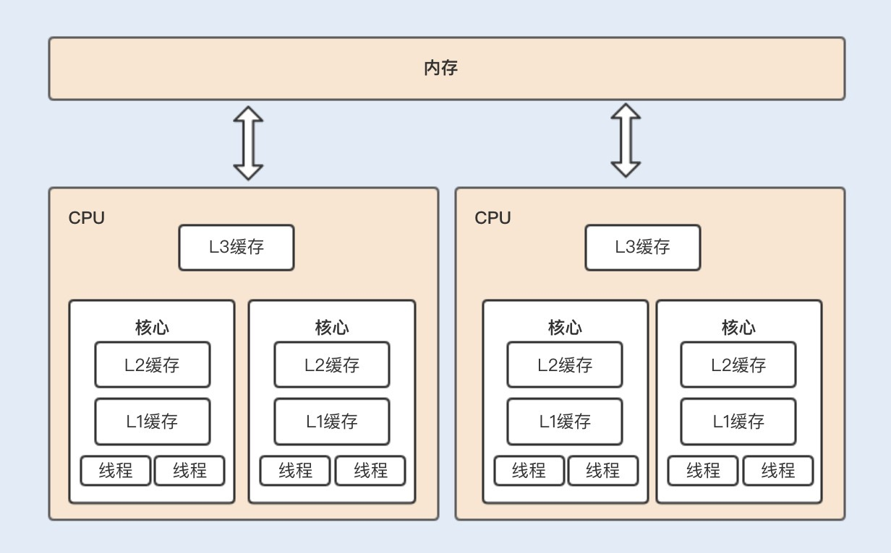

---
date: "2019-06-23"
---  
      
# 加餐 | 什么是数据的强、弱一致性？
你好，我是刘超。

在[第17讲](https://time.geekbang.org/column/article/103541)讲解并发容器的时候，我提到了“强一致性”和“弱一致性”。很多同学留言表示对这个概念没有了解或者比较模糊，今天这讲加餐就来详解一下。

说到一致性，其实在系统的很多地方都存在数据一致性的相关问题。除了在并发编程中保证共享变量数据的一致性之外，还有数据库的ACID中的C（Consistency 一致性）、分布式系统的CAP理论中的C（Consistency 一致性）。下面我们主要讨论的就是“并发编程中共享变量的一致性”。

在并发编程中，Java是通过共享内存来实现共享变量操作的，所以在多线程编程中就会涉及到数据一致性的问题。

我先通过一个经典的案例来说明下多线程操作共享变量可能出现的问题，假设我们有两个线程（线程1和线程2）分别执行下面的方法，x是共享变量：

```
    //代码1
    public class Example {
        int x = 0;
        public void count() {
            x++;                     //1
            System.out.println(x)//2
        }
    }
    

```


如果两个线程同时运行，两个线程的变量的值可能会出现以下三种结果：


## Java存储模型

2,1和1,2的结果我们很好理解，那为什么会出现以上1,1的结果呢？

我们知道，Java采用共享内存模型来实现多线程之间的信息交换和数据同步。在解释为什么会出现这样的结果之前，我们先通过下图来简单了解下Java的内存模型（第21讲还会详解），程序在运行时，局部变量将会存放在虚拟机栈中，而共享变量将会被保存在堆内存中。

<!-- [[[read_end]]] -->


由于局部变量是跟随线程的创建而创建，线程的销毁而销毁，所以存放在栈中，由上图我们可知，Java栈数据不是所有线程共享的，所以不需要关心其数据的一致性。

共享变量存储在堆内存或方法区中，由上图可知，堆内存和方法区的数据是线程共享的。而堆内存中的共享变量在被不同线程操作时，会被加载到自己的工作内存中，也就是CPU中的高速缓存。

CPU 缓存可以分为一级缓存（L1）、二级缓存（L2）和三级缓存（L3），每一级缓存中所储存的全部数据都是下一级缓存的一部分。当 CPU 要读取一个缓存数据时，首先会从一级缓存中查找；如果没有找到，再从二级缓存中查找；如果还是没有找到，就从三级缓存或内存中查找。

如果是单核CPU运行多线程，多个线程同时访问进程中的共享数据，CPU 将共享变量加载到高速缓存后，不同线程在访问缓存数据的时候，都会映射到相同的缓存位置，这样即使发生线程的切换，缓存仍然不会失效。

如果是多核CPU运行多线程，每个核都有一个 L1缓存，如果多个线程运行在不同的内核上访问共享变量时，每个内核的L1缓存将会缓存一份共享变量。

假设线程A操作CPU从堆内存中获取一个缓存数据，此时堆内存中的缓存数据值为0，该缓存数据会被加载到L1缓存中，在操作后，缓存数据的值变为1，然后刷新到堆内存中。

在正好刷新到堆内存中之前，又有另外一个线程B将堆内存中为0的缓存数据加载到了另外一个内核的L1缓存中，此时线程A将堆内存中的数据刷新到了1，而线程B实际拿到的缓存数据的值为0。

此时，内核缓存中的数据和堆内存中的数据就不一致了，且线程B在刷新缓存到堆内存中的时候也将覆盖线程A中修改的数据。这时就产生了数据不一致的问题。



了解完内存模型之后，结合以上解释，我们就可以回过头来看看第一段代码中的运行结果是如何产生的了。看到这里，相信你可以理解图中1,1的运行结果了。


## 重排序

除此之外，在Java内存模型中，还存在重排序的问题。请看以下代码：

```
    //代码1
    public class Example {
        int x = 0;
        boolean flag = false;
        public void writer() {
            x = 1;                //1
            flag = true;          //2
        }
    
        public void reader() {
            if (flag) {           //3
                 int r1 = x;      //4
                 System.out.println(r1==x)
            }
        }
    }
    

```


如果两个线程同时运行，线程2中的变量的值可能会出现以下两种可能：


现在一起来看看 r1=1 的运行结果，如下图所示：


那r1=0又是怎么获取的呢？我们再来看一个时序图：


在不影响运算结果的前提下，编译器有可能会改变顺序代码的指令执行顺序，特别是在一些可以优化的场景。

例如，在以下案例中，编译器为了尽可能地减少寄存器的读取、存储次数，会充分复用寄存器的存储值。如果没有进行重排序优化，正常的执行顺序是步骤1\\2\\3，而在编译期间进行了重排序优化之后，执行的步骤有可能就变成了步骤1/3/2或者2/1/3，这样就能减少一次寄存器的存取次数。

```
    int x = 1;//步骤1：加载x变量的内存地址到寄存器中，加载1到寄存器中，CPU通过mov指令把1写入到寄存器指定的内存中
    boolean flag = true; //步骤2 加载flag变量的内存地址到寄存器中，加载true到寄存器中，CPU通过mov指令把1写入到寄存器指定的内存中
    int y = x + 1;//步骤3 重新加载x变量的内存地址到寄存器中，加载1到寄存器中，CPU通过mov指令把1写入到寄存器指定的内存中
    

```

在 JVM 中，重排序是十分重要的一环，特别是在并发编程中。可 JVM 要是能对它们进行任意排序的话，也可能会给并发编程带来一系列的问题，其中就包括了一致性的问题。

## Happens-before规则

为了解决这个问题，Java提出了Happens-before规则来规范线程的执行顺序：

* 程序次序规则：在单线程中，代码的执行是有序的，虽然可能会存在运行指令的重排序，但最终执行的结果和顺序执行的结果是一致的；
* 锁定规则：一个锁处于被一个线程锁定占用状态，那么只有当这个线程释放锁之后，其它线程才能再次获取锁操作；
* volatile变量规则：如果一个线程正在写volatile变量，其它线程读取该变量会发生在写入之后；
* 线程启动规则：Thread对象的start\(\)方法先行发生于此线程的其它每一个动作；
* 线程终结规则：线程中的所有操作都先行发生于对此线程的终止检测；
* 对象终结规则：一个对象的初始化完成先行发生于它的finalize\(\)方法的开始；
* 传递性：如果操作A happens-before 操作B，操作B happens-before操作C，那么操作A happens-before 操作C；
* 线程中断规则：对线程interrupt\(\)方法的调用先行发生于被中断线程的代码检测到中断事件的发生。

**结合这些规则，我们可以将一致性分为以下几个级别：**

严格一致性（强一致性）：所有的读写操作都按照全局时钟下的顺序执行，且任何时刻线程读取到的缓存数据都是一样的，Hashtable就是严格一致性；


顺序一致性：多个线程的整体执行可能是无序的，但对于单个线程而言执行是有序的，要保证任何一次读都能读到最近一次写入的数据，volatile可以阻止指令重排序，所以修饰的变量的程序属于顺序一致性；


弱一致性：不能保证任何一次读都能读到最近一次写入的数据，但能保证最终可以读到写入的数据，单个写锁+无锁读，就是弱一致性的一种实现。

今天的加餐到这里就结束了，如有疑问，欢迎留言给我。也欢迎你点击“请朋友读”，把今天的内容分享给身边的朋友，邀请他一起学习。